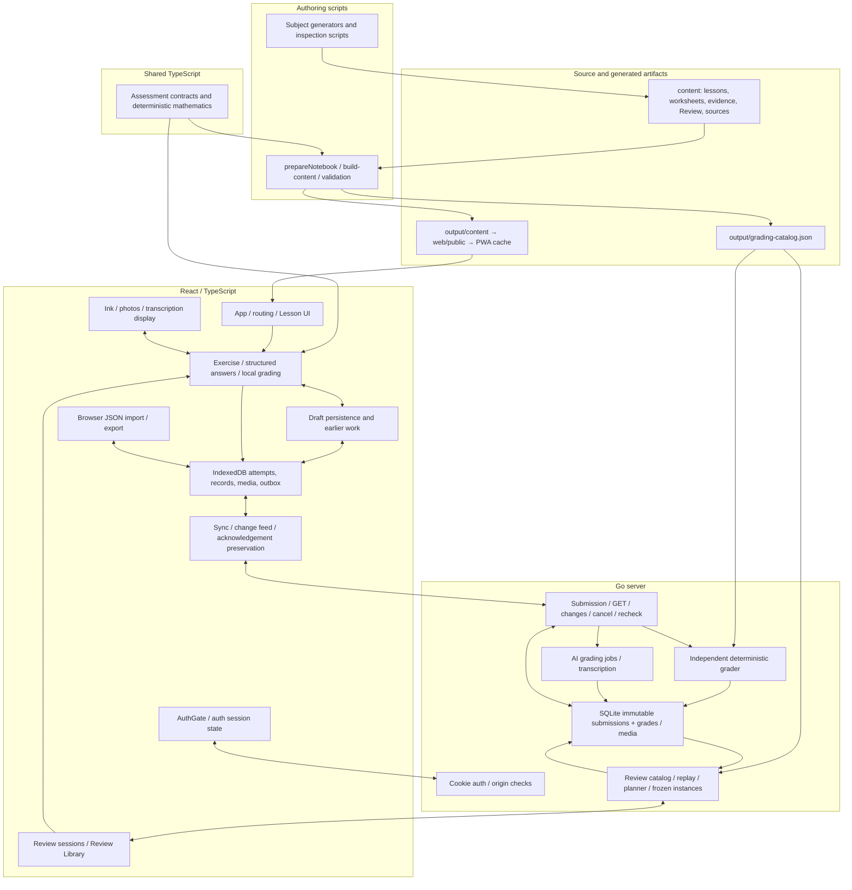

# Architecture audit

> Follow-up: the [declarative curriculum migration](declarative-curriculum-migration.md)
> supersedes this audit's A03/A09 authoring recommendations. Canonical lessons are
> now MDX; curriculum metadata, exercises, reviews, grading contracts, figures and
> source records are directly authored YAML/JSON under `content/`. The entire
> `scripts/authoring/` tree and its aggregate writers are removed after inventory
> and parity checks. Independent mathematical verification tools remain under
> `scripts/verification/`. References below to old authoring paths, invocation order,
> and isolated generation describe the audited historical commit, not the current
> authoring workflow. They are retained as evidence of the original regression.

Audited September 20, 2026, from `main` at `eacb485` after pulling with
`--ff-only`. This is an architecture audit with two bounded refactors, not a
curriculum revision or a scheduler redesign. No merge or deployment is authorized.

## Scope and method

Read `AGENTS.md`, [spaced repetition](spaced-repetition.md),
[Review implementation](review-system.md), [deterministic contracts](deterministic-contract.md),
[study plan](study-plan.md), [final curriculum verification](final-curriculum-verification.md),
[adversarial audit](deterministic-adversarial-audit.md), and
[offline verification](browser-offline-verification.md). Inspected the bodies and
changed modules of merged PRs [#9](https://github.com/johncrowleydev/math-foundations/pull/9),
[#10](https://github.com/johncrowleydev/math-foundations/pull/10),
[#11](https://github.com/johncrowleydev/math-foundations/pull/11), and
[#12](https://github.com/johncrowleydev/math-foundations/pull/12).

The examination covers `web`, `shared`, `server`, authoring/build/verification
scripts, content contracts, CI, exports, and deployment boundaries. Independent
subtasks used separate worktrees. Evidence includes call-site and import searches,
compiler unused-symbol diagnostics, synthetic boundary probes, generator output
comparisons, and the validation recorded below. No production database, account,
provider, or service was used. Static cost analysis is not a latency benchmark;
absence of a search hit is not proof that historical data is unsupported.

## Architecture map

The service worker caches the application and curriculum, not API responses.
Review caches are explicit IndexedDB records. Go owns due dates, activation,
evidence-depth eligibility, Quick eligibility, and planning. The browser owns
unfinished work and can grade deterministic responses offline; its outbox records
whether a locally graded attempt still needs acknowledgement. A separate Python
analysis exporter reads a consistent SQLite snapshot into a version-2 ZIP; that
ZIP is deliberately different from browser-import JSON.

## Findings

Categories describe architectural value, not a claim that every item is a
production incident. No **BLOCKING** finding prevents this bounded refactor.
Each finding states whether the proposed follow-up changes behavior; implemented
changes preserve behavior.

| Category              | Findings |
| --------------------- | -------: |
| BLOCKING              |        0 |
| HIGH VALUE            |        6 |
| MEDIUM VALUE          |        8 |
| LOW VALUE             |        3 |
| NO CHANGE RECOMMENDED |        4 |

The most urgent follow-ups are backup/media retention (A13), import/export wire
compatibility (A01), and deterministic boundary parity (A02). The largest
maintainability opportunities are authoring ownership (A03/A14) and Review replay
decomposition (A04).

### A01 — HIGH VALUE: wire-compatible attempts are not a closed import/export model

- **Files/evidence:** `web/src/types.ts` (`Attempt`, `Question`),
  `web/src/serverAttempt.ts:36–51,75–103`, `web/src/storage.ts:277–363`,
  `web/src/sync.ts:154–206`, `server/grading.go:116–150`.
  `validServerAttempt` accepts `analytics: null` and validates historical
  `question.answer: null` through a temporary projection, then narrows the
  unmodified object to `Attempt`. That type allows neither null. Sync persists
  the original reply. `importData` instead calls `validSnapshot` and
  `validPresentation` without those compatibility projections.
- **Concrete reproduction:** using fake IndexedDB, create a synthetic otherwise
  valid pending typed attempt, add either `analytics: null` or
  `presentation: { question: { instructions: 'Synthetic prompt.', answer: null } }`,
  and call `validServerAttempt → put → exportData → importData`.
  Validation returns true; importing each export throws `Invalid attempt.`
  No learner data was involved. Go's stored context can carry explicit null
  analytics; `loadAttempt` assigns `answer` from a possibly absent
  `officialAnswer`. These are existing supported wire shapes, not invented
  future fields.
- **Why it matters:** server replies, local observations, queued submissions,
  and archives share a type while obeying incompatible shape rules. Local
  export/import is not closed over accepted server data.
- **Recommendation:** introduce only the useful boundary types: submission,
  server attempt, and local attempt/archive compatibility profile. Make parsing
  return a value or an error rather than claiming an unmodified wire object is
  already the domain type. Preserve raw confirmed history; normalize optional
  absent/null representations only where their documented semantics agree.
  Add server-serialization-to-browser-export/import round trips for both cases
  before changing the boundary. Do not make immutable comparison more permissive
  for existing nonempty answers or evidence.
- **Risk / behavior / implemented:** medium risk; a complete fix changes import
  acceptance and needs historical fixtures. **Deferred**, not silently fixed by
  this refactor.

### A02 — HIGH VALUE: shared examples do not yet define the entire deterministic boundary

- **Files/evidence:** `shared/deterministic.ts` (`validateAssessment`,
  `gradeAssessment`), `server/deterministic.go` (`validateAssessment`,
  `validateResponse`), `web/src/structuredAnswer.ts:8–25`,
  `shared/deterministic-definition-cases.json`, and the shared fixture consumers.
  The Go response validator limits strings to 4,096 **UTF-8 bytes**. The shared
  TypeScript term grader lacks that limit; the browser's archival shape check
  allows 20,000 JavaScript string units. Requirement `evidenceLevel: ''` is
  rejected by TypeScript but accepted by Go's optional string representation.
- **Concrete reproduction:** against the adversarial corpus's term assessment
  accepting `linearly independent`, 4,095 spaces followed by `x` is incorrect in
  both runtimes. 4,096 spaces followed by `x` is incorrect in TypeScript but an
  input error in Go. So is `é` repeated 2,049 times (4,098 UTF-8 bytes).
  The empty-evidence-level probe likewise disagrees on definition validity.
- **Why it matters:** a local mathematical verdict can become a rejected upload;
  this is a contract discrepancy outside the well-tested mathematical oracle.
  PR #11 already demonstrated four parser discrepancies, so parity needs
  continuing independent enforcement.
- **Recommendation:** extend the shared data fixtures with boundary cases for
  missing/null/empty fields, byte versus character lengths, field counts,
  generated input IDs, and optional enums. Name current-definition, live-response,
  and historical-envelope profiles explicitly. Agree the limits before fixing
  either runtime. Keep independent algorithms; do not generate the Go grader
  from TypeScript or treat either implementation as the oracle.
- **Risk / behavior / implemented:** medium risk; resolving the discrepancies
  changes acceptance. **Deferred**. Existing corpus passes do not prove universal
  language equivalence.

### A03 — HIGH VALUE: subject generation is a multi-writer aggregate pipeline

- **Files/evidence:** `scripts/authoring/calculus.mjs`,
  `scripts/authoring/probability-statistics.mjs`, their inspection scripts,
  `content/review-templates.json`, `content/sources.json`, and shared curriculum,
  figure, formula, and typing aggregates, plus subject evidence files. Both generators load existing
  aggregate files, remove their own entries, and append regenerated subject
  entries. The PR #12 preservation code rereads old Review/source output to
  maintain existing order and citation dates. This is a real ownership problem
  upstream of the normal build, which consumes committed `content/`.
- **Concrete reproduction:** in a pristine baseline archive, running Calculus
  alone changes subject order from Discrete / Linear / Calculus / Probability
  to Discrete / Linear / Probability / Calculus. Running Probability afterward
  restores it. Both baseline and refactored writers exhibit this behavior; the
  chosen extraction deliberately does not introduce an order-policy change.
- **Why it matters:** adding a later subject can make an earlier generator move
  or overwrite aggregate entries. Array order participates in grading-version
  hashing. Preserving selected maps and Review arrays does not establish
  composition or order independence for the other aggregates. A source digest
  is editorial evidence and must not be refreshed as an incidental generator
  side effect.
- **Recommendation:** adopt isolated subject artifacts and one deterministic
  assembly step incrementally, following the migration below. Retain today's
  content build as the validation gate. The shared preservation helper in A09
  reduces duplication but does not solve ownership or reproducibility.
- **Risk / behavior / implemented:** high migration risk because ordering and
  frozen-definition identities are compatibility contracts. Intended published
  behavior must remain identical. **Deferred**, except A09's exact extraction.

### A04 — HIGH VALUE: Review replay mixes pure rules, projections, and repeated catalog/database work

- **Files/evidence:** `server/review.go:178–294,406–617,720,799,932`,
  `server/review_catalog.go:47,89`, `server/grading.go:116–150`,
  `server/main.go:91`. Summary, planner, Library, preview, and restore each build
  the effective catalog. `reviewStates` reads prior states, activations, and
  attempt IDs; `loadAttempt` performs four queries per attempt, including
  presentation/job data. Review attempts add an instance lookup. Each attempt
  scans the template pool; each resulting state adds a comparison read before
  writing only changed projections. The baseline effective pool has 4,827
  templates. SQLite uses one connection.
- **Why it matters:** rendering a summary can perform a full evidence replay and
  persistence work. The broad input/output boundary makes scheduler changes hard
  to test independently, and static work grows with attempts × templates plus
  per-attempt queries. This is a cost model, not a measured user-visible slowdown.
- **Recommendation:** first extract a pure replay function with explicit prior
  state, activations, ordered observations, frozen instances, and catalog inputs;
  compare its complete results against current replay. Then build per-catalog
  indexes and batch-load only required observations. Cache only immutable
  catalog-derived data, with explicit replacement in tests. Keep full replay as
  the reference implementation; no incremental scheduler is justified yet.
- **Risk / behavior / implemented:** medium/high risk; intended behavior unchanged.
  Preserve the prior evidence-depth floor and removed-target state at
  `review.go:429,581–609`; attempts plus today's catalog alone are insufficient.
  **Deferred** to a dedicated PR.

### A05 — MEDIUM VALUE: learner-facing completion is interpreted inconsistently

- **Files/evidence:** `web/src/Exercise.tsx:178–185`,
  `web/src/Review.tsx:47,102–105`, `web/src/App.tsx:154–158`,
  `web/src/analytics.ts` (`exerciseProgress`). Exercise excludes a deterministic
  attempt with `status: 'error'` from its correct-answer lock. Review continuation,
  restored-session selection, App progress, and `exerciseProgress` check a correct
  verdict without that exception. Sync can retain a local deterministic verdict
  when a 400/409 rejection changes status to `error`.
- **Why it matters:** the same reachable rejected local answer can allow a retry
  in Exercise while being counted as complete elsewhere. Status, verdict, and
  delivery acknowledgement are different dimensions, represented by free strings
  and scattered conditions.
- **Recommendation:** define a small learner-facing completion predicate and a
  separate pending-grading predicate, with a table of rejected local grades,
  cancelled rechecks, retained prior verdicts, and queued deterministic grades.
  Do not apply that predicate blindly to immutable evidence reports or change
  server scheduling. Track delivery through the existing outbox, not a new
  redundant status flag or state-machine dependency.
- **Risk / behavior / implemented:** medium risk; harmonizing the displays changes
  current edge-case behavior. **Deferred** pending explicit expected-state tests.

### A06 — MEDIUM VALUE: Exercise's draft lifecycle is a meaningful extraction boundary

- **Files/evidence:** `web/src/Exercise.tsx:44–173,187–360` (994 lines overall).
  Four asynchronous loaders coordinate draft initialization, legacy recovery,
  current attempts, and cross-tab revisions. `latestDraft`, `touched`, `writes`,
  `saveError`, the effort clock, and a synchronous submission lock coordinate
  editing, persistence, grading, and retries in the same render component.
  PR #10's ref lock prevents multiple submissions before React commits state.
- **Why it matters:** a presentation edit can disturb ordering between hydration,
  edits, blur, grading, and durable writes. Existing tests demonstrate these races
  are consequential, not hypothetical.
- **Recommendation:** extract the cohesive draft lifecycle (hydrate/reconcile,
  serialize writes, flush, and report failures) behind one hook/controller only
  after writing its operation-order contract. Keep attempt construction and
  submission separate. Reuse hydration, rapid-edit, rapid-submit, and offline
  tests; retain the synchronous lock and liveness checks. Splitting arbitrary JSX
  into tiny files would not address this problem.
- **Risk / behavior / implemented:** medium/high risk; behavior must be unchanged.
  **Deferred** because extraction needs a dedicated race-focused PR and visual
  checks if rendered structure changes.

### A07 — MEDIUM VALUE: Review and evidence wire contracts depend on unchecked extra properties

- **Files/evidence:** `web/src/reviewTypes.ts`, `web/src/reviewValidation.ts`,
  `web/src/reviewApi.ts:45–85`, `web/src/evidenceValidation.ts`,
  `server/review.go:27–100,954`, `server/evidence.go:36–95`.
  TypeScript Review parameters are `Record<string, unknown>` and only
  object-checked; Go uses `map[string]int`. Historical restore bounds intervals to
  180 days while the browser's shape check only requires nonnegative values.
  `ReviewInstance` omits the server's frozen `teaching` field; it survives browser
  export because the API object is spread into generic records. ReviewState
  omits `consecutiveDelayedSuccesses`. Live session/summary JSON is asserted to
  its type and cached without the import validator.
  Separately, `Diagnosis.severity` excludes the empty string in its TS type while
  both its validator and Go/provider schema accept it. Go's serialized
  `Grade.Usage` is undeclared in TS; its provider assignment and export persistence
  establish that it is telemetry, not a dead field.
- **Why it matters:** a future typed reconstruction could discard the teaching
  snapshot required for frozen restore. Shape validation, live trust, historical
  readability, and server authorization currently have similar names without a
  central compatibility policy. Evidence enums also recur in TS types/validators,
  Go validators, and the provider JSON schema.
- **Recommendation:** document and test the complete persisted wire envelope,
  including opaque frozen teaching and intentionally undisplayed fields. Add
  shared enum/shape fixtures to both runtimes and explicit live/archive profiles;
  validate live responses before durable cache writes. Do not make legacy grade
  readers require new v5 fields or let browser checks substitute for Go's issued
  instance comparison. No source-code generation framework is needed.
- **Risk / behavior / implemented:** medium risk; type documentation can preserve
  behavior, stricter live validation changes rejection behavior. **Deferred**.

### A08 — MEDIUM VALUE: important architecture checks remain outside CI

- **Files/evidence:** `.github/workflows/ci.yml`, `package.json`,
  `web/package.json`, `scripts/check-*-ui.mjs`,
  `scripts/check-offline-hardening.mjs`, `web/tests/*.browser.mjs`,
  `scripts/export_learning_test.py`. CI runs root TypeScript tests, typecheck,
  build, web Node tests, format checks, and Go race tests. It does not invoke the
  browser scripts. The Python export test **is** invoked indirectly by
  `scripts/evidence.test.ts`, so it is already covered by `npm test`.
  Browser checks depend on an externally
  installed Playwright module/Chrome and several overwrite tracked screenshot
  paths. Independent source generators are likewise not an ordinary build step.
- **Why it matters:** a green PR can miss hydration/service-worker regressions,
  frozen export behavior, or generator composition errors. The recent audits
  found defects through exactly these additional checks. This does not invalidate
  the independent mathematical corpus already run by CI.
- **Recommendation:** add a documented browser smoke job with a project-pinned
  runtime and temporary artifact paths, retain the Python export test, and
  add isolated generator equivalence checks when A03 is migrated. Keep large
  materialized fixtures named by case and validator; do not replace independent
  expectations with values computed by either grader.
- **Risk / behavior / implemented:** low/medium tooling risk; no product behavior
  change intended. **Deferred** rather than adding infrastructure in this PR.

### A09 — MEDIUM VALUE: identical authoring preservation policy had two implementations

- **Files/evidence:** `scripts/authoring/calculus.mjs` and
  `scripts/authoring/probability-statistics.mjs` duplicated the PR #12 policy that
  retains existing Review order and unchanged citation inspection dates.
- **Why it matters:** changing one subject's preservation policy can silently
  move IDs or churn inspection records in the other. This is policy duplication,
  not independent mathematical verification.
- **Recommendation / implemented:** **Implemented** one authoring helper used by
  both subjects (`scripts/authoring/aggregate-writer.mjs`), preserving the existing
  algorithm and format. Two tests in `scripts/authoring-aggregate.test.ts`
  cover removal/replacement, stable order, appended new identities, existing
  later citation dates only when the supporting passage is unchanged, and the
  supplied date when the passage changes. The writer never invents inspection
  dates. Output-equivalence evidence and exact metrics are below.
- **Risk / behavior:** low risk; no published content, IDs, versions, order,
  citation assignments, or runtime behavior changes.

### A10 — LOW VALUE: one bounded comparison helper was dead

- **Files/evidence:** `comparisonFromStrings` in `shared/comparison.ts`, imported
  but never called in `shared/quantified.ts`. Tracked whole-repository symbol
  searches found only that definition and unused import. There is no public
  package export map, reflection-based dispatch to it, documented invocation,
  archive field named for it, or generator consumer. The compiler also reports
  unused related imports.
- **Recommendation / implemented:** **Removed** the helper and associated unused
  imports. Kept the active comparison parser and independent Go implementation.
- **Risk / behavior:** low risk; no call path or serialized data changes. Existing
  quantified/comparison and adversarial fixtures exercise the retained code.

### A11 — LOW VALUE: canonical JSON comparison is repeated but not worth broad unification

- **Files/evidence:** `web/src/serverAttempt.ts:8–18` and
  `web/src/importGrading.ts:6–16` contain the same object-key-sorting JSON
  serializer. `assessmentFingerprint` in `structuredAnswer.ts:68–91` also sorts
  keys, but deliberately projects only response-defining question fields.
- **Why it matters / recommendation:** a small shared JSON-value comparison
  helper could remove duplicate mechanics during A01. Keep fingerprint projection
  and ordered arrays explicit; do not globally replace exact historical-record
  equality or content hashing. A generic equality framework is unnecessary.
- **Risk / behavior / implemented:** low risk for the two identical serializers;
  medium if generalized across projections. Intended behavior unchanged.
  **Deferred** to avoid another unrelated cleanup.

### A12 — LOW VALUE: provider evidence validation is immediately repeated

- **Files/evidence:** `parseV5Grade` returns `validateGradeEvidence` at
  `server/evidence.go:85`; `evaluate` calls the same validator again at
  `server/grading.go:603` after setting only `Model`, which the validator does not
  inspect.
- **Why it matters / recommendation:** the second call obscures which layer owns
  provider-envelope validity. Remove it when the grading boundary is next edited;
  retain the distinct diagnosis-ID and mathematical-text checks.
- **Risk / behavior / implemented:** low risk; no behavior change intended.
  **Deferred**; three lines alone do not justify widening this implementation.

### A13 — HIGH VALUE: media retirement does not account for retained backups

- **Files/evidence:** `server/deploy/backup.sh:5–9`,
  `server/transcription.go:95–126`, `server/transcription_test.go`.
  Weekly backups snapshot SQLite and retain recovery points for 35 days. The
  backup script says media will not be collected while a retained backup may
  reference it. `removeRetiredMedia` checks only live attempts and versions before
  deleting the image file; it does not inspect retained backup references or
  retain an image snapshot with each database backup.
- **Concrete reproduction:** an isolated Go test used existing synthetic grading
  helpers and a temporary media directory: submit a photo, take `VACUUM INTO`
  backup, finish grading/transcription, run retirement, and reopen the earlier
  database. The restored attempt has one image reference, no transcription, and
  its referenced file no longer exists. Current transcription tests establish
  live deletion; the existing database backup test does not exercise this timing.
- **Why it matters:** immutable evidence spans the database and media store.
  Live-record reachability is insufficient to establish backup recoverability.
  This is a reproduced recovery gap, not just a misleading comment.
- **Recommendation:** give the backup/retirement boundary one retention policy:
  either snapshot referenced media with each recoverable database or protect
  media until every retained recovery point that needs it has expired. Add a
  pre-transcription-backup restore regression and an explicit missing-media
  check. Keep live transcription retirement and weekly backups; do not patch
  this by changing only the comment.
- **Risk / behavior / implemented:** medium operational risk; correction changes
  deletion/backup behavior and storage retention. **Deferred** to a focused repair;
  no production data, timer, or deployment script was changed.

Follow-up: [backup and media recovery integrity](backup-media-integrity.md)
documents the focused repair: self-contained database/media snapshots, atomic
publication, retention locks, verified restoration and pruning regressions. The
former `-mtime +35` policy actually becomes eligible at 36 completed days; that
threshold is preserved. Historical database-only backups are not repaired.

### A14 — HIGH VALUE: a historical generator overwrites modern Review fixtures

- **Files/evidence:** `scripts/authoring/deterministic-review.py:216–218` writes
  its 22 owned cases over all of `content/deterministic-review-fixtures.json`
  while retaining the larger template array. In an isolated baseline archive,
  running the script successfully changes the fixture count **698 → 22**,
  dropping 676 unrelated template/variant cases.
- **Why it matters:** the retained authoring source is unsafe to rerun against
  the current aggregate. `scripts/review-templates.ts:149–153` detects the missing
  fixtures during normal publication, so this is a broken authoring workflow,
  not evidence of silent deficient publication. No package or CI command invokes
  the script, but it still encodes live historical identities.
- **Recommendation:** replace only explicitly owned `(template, variant)` rows,
  preserving all unrelated cases and existing order, with a current-catalog
  regeneration test. Alternatively archive it explicitly after establishing a
  supported replacement source. Do not delete it merely because CI has no caller.
- **Risk / behavior / implemented:** medium risk; it also rewrites assessment
  metadata and needs equivalence checks. No runtime behavior change intended;
  authoring preservation would change. **Deferred** from the exact helper extraction.

### A15 — MEDIUM VALUE: subject builders hide evidence-depth policy in validator defaults

- **Files/evidence:** Calculus's `assessment` helper in
  `scripts/authoring/calculus.mjs` classifies boolean, term, and selection as
  recognition. `scripts/authoring/probability-statistics/assessment.mjs:22`
  classifies only boolean and selection that way. Current definitions contain
  **72 Calculus term assessments tagged recognition** and **16 Probability term
  assessments tagged production**. The Probability builder also supports different
  field/grid shapes and cannot simply be replaced by the Calculus helper.
- **Why it matters:** evidence-depth defaults are partly incidental subject code,
  yet determine Review eligibility. The same validator name does not establish
  the same pedagogical demand, so the observed difference is not itself proof
  that either classification is wrong.
- **Recommendation:** document the intended classifications in authored metadata
  and fixture cases before consolidating any default policy. Preserve explicit
  task-specific differences. Keep scalar/grid construction distinct where needed.
- **Risk / behavior / implemented:** medium/high risk if tags change; documenting
  existing policy need not change behavior. **Deferred**; no evidence levels or
  source-reviewed content were reclassified.

### A16 — MEDIUM VALUE: Go input-error tests can pass for a definition error

- **Files/evidence:** `server/deterministic_test.go:48–74` and
  `server/deterministic_adversarial_test.go:34–40` accept any nonnil error for an
  expected input error. Go's `gradeAssessment` can return definition-validation
  errors through that same return. The TS family runner explicitly prevalidates
  definitions. Across shared fixture files, 14 distinct definitions occur only
  in error cases, including the `log2-no-positive-domain` and
  `initial singular point rejected` cases.
- **Why it matters:** a future regression rejecting an otherwise valid definition
  can make its response-error test pass for the wrong reason. This is a test
  sensitivity gap, not a claim that today's passing cases are currently wrong.
- **Recommendation:** prevalidate fixture/adversarial definitions in the Go harness
  with definition-specific failure messages. Consider a typed boundary error only
  if later refactoring needs it. Preserve production's separate authored-definition
  503 and learner-input 400 handling; its apparently repeated validation has a
  purpose, unlike A12's repeated provider-evidence check.
- **Risk / behavior / implemented:** low risk for test preflight, medium for error
  type changes; no runtime behavior change required. **Deferred** from this PR's
  two independent implementation changes.

### A17 — MEDIUM VALUE: some HTTP boundaries classify infrastructure failure as bad input

- **Files/evidence:** `server/review.go:882–884,912–915`,
  `server/grading.go:460–463,479,504`, `web/src/sync.ts:244–258`.
  Review planning maps all returned errors, including SQL failures, to 400.
  Review import, cancellation, and recheck map all operation errors to 409;
  attempt GET maps all load failures to 404. These operations contain database
  calls that return infrastructure errors through the same path as domain errors.
- **Why it matters:** the client treats attempt/recheck 400/409 responses as
  permanent rejection, retains them in rejected-operation settings, and removes
  their outbox entry. Review import remains queued, but the same status has a
  different retry consequence. The transport classification obscures whether
  the user should correct input, retry later, or investigate server storage.
- **Recommendation:** distinguish known input/conflict/not-found errors at HTTP
  boundaries from unexpected storage failures and return retryable 5xx for the
  latter. Add fault-injection cases for recheck/planning/loading before changing
  mapping; keep original attempts and rejection archives intact. Do not collapse
  mathematical input guidance, provider failure, and infrastructure errors.
- **Risk / behavior / implemented:** medium risk; HTTP status and retry behavior
  would change. **Deferred**, no API error mapping changed in this PR.

### N01 — NO CHANGE RECOMMENDED: independent deterministic algorithms

**Files/evidence:** `shared/{exact,calculus,linear,logic,quantified,sets,graph,...}.ts`,
`server/deterministic*.go`, shared fixtures, adversarial generator, and provider
traps. Exact arithmetic, bounded symbolic languages, natural-domain preservation,
finite constructions, and incorrect/input-error distinctions account for much of
the size. **Why/recommendation:** independent implementations are valuable
cross-checks; share data contracts and independently expected cases, not evaluator
code. **Risk/behavior/implemented:** replacing them would be high risk; no change
implemented or recommended. A02 records the remaining boundary gaps.

### N02 — NO CHANGE RECOMMENDED: server-owned scheduling and separate evidence

**Files/evidence:** `server/review.go`, `review_catalog.go`, `web/src/reviewCatalog.ts`,
`analytics.ts`, `reviewApi.ts`. The Library obtains the planner's effective
templates and Quick flag. Browser coverage groups returned items for display;
analytics produces descriptive evidence summaries, not due dates. Passive
exposures are not scheduler inputs. **Why/recommendation:** retain immutable
submissions and append-only diagnoses separately from mutable schedule records.
Do not turn UI counts into a second scheduler. **Risk/behavior/implemented:**
moving scheduling into React or sharing report predicates blindly would be high
risk; no such change implemented. A04 concerns decomposition and repeated work,
not interval semantics.

### N03 — NO CHANGE RECOMMENDED: historical compatibility is active behavior

**Files/evidence:** `nativeInk.ts`, `routing.ts`, `exerciseIdentity.ts`,
`storage.ts` (`readingBookmark`, `recoverEffortRejections`),
`server/restore_integrity.go`, `evidence_backfill.go`, `transcription.go`.
Native ink has live encode/decode callers and tests. Split lessons still use old
exercise namespaces and section/bookmark resolution. Frozen Review and old grade
records are explicitly supported by restore tests. **Why/recommendation:** keep
these paths unless a supported-data migration and retention policy replaces them.
**Risk/behavior/implemented:** high deletion risk; no removals. In particular,
incomplete legacy transcription history cannot authorize deleting local media.

### N04 — NO CHANGE RECOMMENDED: build, content version, and error distinctions

**Files/evidence:** `scripts/build-content.ts:40–70`, `sources.ts`,
`web/src/structuredAnswer.ts`, `sync.ts`, `server/grading.go`, `auth.go`.
The normal build validates authored content, compiles adapted questions, and hashes
published lessons/evidence/templates. Source bibliographic metadata is separate.
Draft fingerprints describe response identity; frozen versions describe historic
grading context. Input guidance creates no mathematical failure; provider
`not_graded` differs from an incorrect answer; network failure retains the outbox;
malformed successful replies fail preservation; 401 locks the session.
**Why/recommendation:** retain these distinct meanings and offline hash routing.
**Risk/behavior/implemented:** collapsing errors, versions, or all validators into
one helper would be high risk; no such change. A01/A07 specify clearer boundary
profiles rather than weaker checks.

## Duplication inventory

| Concept / locations                                                                                                                | Classification                | Disposition                                                                                                                                 |
| ---------------------------------------------------------------------------------------------------------------------------------- | ----------------------------- | ------------------------------------------------------------------------------------------------------------------------------------------- |
| Exact parsing, symbolic calculus, Boolean/quantified expressions; `shared/*` ↔ Go deterministic modules                            | **GOOD DUPLICATION**          | Independent exact implementations; retain parser limits and domain proofs; extend shared cases at boundaries.                               |
| Finite sets, relations, maps, graph constructions                                                                                  | **GOOD DUPLICATION**          | Shared materialized cases plus Python set/permutation oracles; do not derive Go expectations from TS.                                       |
| Assessment/StructuredResponse schema and validator registry; `shared/assessment.ts`, `deterministic.ts`, `server/deterministic.go` | **SHARED CONTRACT CANDIDATE** | Shared acceptance/rejection fixture profiles, enum names, bounds, generated field identities. A02 demonstrates drift.                       |
| Choice/structured submission gates and deterministic recheck/restore protection                                                    | **GOOD DUPLICATION**          | Browser provides immediate guidance; server independently prevents provider fallback and forged imports.                                    |
| Attempt modes, statuses, verdicts; TS types/validators, Go Submission/Attempt/Grade and SQL                                        | **SHARED CONTRACT CANDIDATE** | Declare distinct local delivery/job/attempt/outcome states; fixture-test serialization instead of one unrestricted string union everywhere. |
| Grade evidence enums, effort, assistance, snapshots; TS types/validators, Go evidence/provider schema                              | **SHARED CONTRACT CANDIDATE** | Share enum/shape examples. Preserve stricter new-provider validity and permissive historical readers as separate profiles.                  |
| Review context/template/catalog/session wire envelopes                                                                             | **SHARED CONTRACT CANDIDATE** | Include frozen teaching and optional/null policy; versioned restore cases. Do not share planner implementation.                             |
| Review target key: Go `concept:skill:objective`; browser/report JSON tuple grouping                                                | **INTENTIONAL DIVERGENCE**    | Persistent identity versus ephemeral grouping; do not replace stored target keys with UI serialization.                                     |
| Evidence depth and Quick eligibility                                                                                               | **INTENTIONAL DIVERGENCE**    | Authoring validates definitions; Go enforces eligibility; React filters the server's effective pool. Keep one runtime eligibility owner.    |
| Browser descriptive analytics versus Go outcome/interval interpretation                                                            | **INTENTIONAL DIVERGENCE**    | Similar diagnosis predicates have different outputs; analytics is not a scheduler oracle.                                                   |
| Shared TS used in build and browser; authoring imports pure `web/src/evidenceTypes.ts` / `exerciseIdentity.ts`                     | **REFACTOR CANDIDATE**        | Move pure domain contracts into `shared/` only when touching them; no React runtime is pulled into the build today.                         |
| Draft assessment fingerprint versus grading content version/source review digest                                                   | **INTENTIONAL DIVERGENCE**    | Response identity, published grading definition, and editorial inspection are different invariants.                                         |
| Browser version-1/2 JSON versus server analysis ZIP v2                                                                             | **INTENTIONAL DIVERGENCE**    | Different purposes and trust boundaries; matching version numbers do not mean matching formats.                                             |
| Authoring Review order/citation preservation                                                                                       | **REFACTOR CANDIDATE**        | Consolidated in A09; independent implementations provide no verification benefit here.                                                      |
| Subject assessment evidence-depth defaults                                                                                         | **SHARED CONTRACT CANDIDATE** | A15: document intentional task differences before deduplicating policy.                                                                     |
| Key-sorted JSON equality for import definitions and immutable sync context                                                         | **REFACTOR CANDIDATE**        | Small later consolidation; preserve each caller's field projection and ordered arrays.                                                      |

## Attempt and draft transitions

This table documents the existing model; it does not introduce a new state machine.
Immutable evidence means preserving the logical response and grading history,
not byte-identical submission JSON forever: transcription retirement changes media
fields only after retaining the transcript and source hash; evidence backfill adds
explicitly labeled historical metadata.

| Event / owner                         | Transition and invariant                                                                                                                                                                                             |
| ------------------------------------- | -------------------------------------------------------------------------------------------------------------------------------------------------------------------------------------------------------------------- |
| Hydrate/edit — browser                | Reconcile draft fingerprint; archive earlier responses when definitions differ; serialized writes must finish before submission. Scratchwork is mutable and separate from evidence.                                  |
| Submit — browser                      | Synchronous lock → flush draft writes → freeze new attempt ID → local deterministic grade or `queued` open response → atomic attempts/outbox transaction. A locally `graded` attempt can still be unacknowledged.    |
| Upload — browser/Go                   | Restore issued Review records first; upload media; validate Go acknowledgement identity/context before removing the queued operation. Server independently grades deterministic submissions.                         |
| Open grading — Go                     | `pending` → `grading` → `graded` / `not_graded`; provider job has its own `pending`/`running`/`done`/`failed` states. Retries retain the submission.                                                                 |
| Recheck — browser/Go                  | Existing grade history stays; a new job enters `rechecking` when there is a previous verdict. A cancelled or failed recheck may retain an earlier correct verdict. Deterministic answers cannot request a model job. |
| Cancel — Go                           | Cancel the identified job, never a newer one; retain input and history; delayed worker completion is rejected by job state.                                                                                          |
| Transcription/media — Go then browser | Retain graded nonblank transcription; retire images/photo references/ink together; protect live draft/attempt/version references; retained backup references are currently omitted (A13).                            |
| Download — browser                    | Validate batch shape, compare queued/cache/confirmed authorities in one transaction, enforce append-only confirmed grades, then update records and cursor.                                                           |
| Import — browser/Go                   | Validate/archive original JSON, preserve conflicts, reset imported record revisions to zero, restore frozen instances before dependent submissions; Go replays evidence, not imported due dates.                     |
| Content upgrade — both                | Current curriculum changes normally; draft fingerprints retain earlier work and frozen Review/attempt definitions remain historical authority.                                                                       |

No audited attempt status is proven unreachable merely because another status has
a similar label. `queued` is local-only; grading-job `running` is not an attempt
status. `error + previous verdict`, `cancelled + previous grade`, and
`graded + outbox` are reachable and must survive any enum cleanup. The one
demonstrated interpretation disagreement is A05.

## API and transport boundaries

| Boundary                                                | Owner / current model                                                                | Architectural assessment                                                                                                                                                       |
| ------------------------------------------------------- | ------------------------------------------------------------------------------------ | ------------------------------------------------------------------------------------------------------------------------------------------------------------------------------ |
| Auth login/session/logout                               | `auth.ts` ↔ `server/auth.go`; cookie, generation counter, offline remembered session | Separate from notebook exports. Queue/epoch protections are intentional; retain.                                                                                               |
| POST attempt                                            | `attemptSubmission` ↔ Go `Submission`                                                | Go has a useful explicit request model. TS projects by removing fields from `Attempt`; A01 proposes an explicit request type. Structured scratchwork is deliberately excluded. |
| GET attempt / POST acknowledgement / cancellation reply | Go `loadAttempt` ↔ `validServerAttempt` and preservation checks                      | Wire omission/null/default rules need one documented policy; shape validity alone cannot authorize replacement.                                                                |
| Changes / attempt snapshot / status manifest            | `main.go` ↔ `sync`/`integrate`; versioned records                                    | Attempt preservation is strong. Generic payload casts and manually shaped response envelopes remain; add contract fixtures before broader parsing refactors.                   |
| Review summary/session                                  | Go `reviewSummary`/planner ↔ `reviewApi`                                             | Server-owned schedule, cached presentation; live responses currently cast, A07.                                                                                                |
| Review Library/preview                                  | `review_catalog.go` ↔ `reviewCatalog`/`ReviewLibrary`                                | Reuses effective catalog/instantiation; read-only preview creates no observations.                                                                                             |
| Review import                                           | `storage.importData` ↔ `Grading.importReview`/`restore_integrity`                    | Frozen definitions and regraded deterministic outcomes checked by server; retain stricter authority checks.                                                                    |
| Browser JSON export/import                              | IndexedDB `storage.ts`                                                               | Offline work, queue, media and archive compatibility; demonstrated null closure gap in A01.                                                                                    |
| Analysis export                                         | `scripts/export-learning-data.py`                                                    | Read-only SQLite snapshot, curriculum/media/hash manifest; intentionally not an API route or browser restore format.                                                           |
| Media/transcription                                     | Hash-addressed `/media/{id}`, Go transcription, browser media stores                 | Binary integrity and graded retirement are distinct policies; retain both.                                                                                                     |
| Recheck                                                 | `sync.recheck` ↔ `grading.go`                                                        | New job and reason attached to an immutable answer; provider and deterministic paths remain separate.                                                                          |

There is no central request/response contract file covering all these endpoints.
The Review and deterministic docs define parts well; Go structs/JSON maps and TS
assertions are the remaining de facto specification. The recommendation is small
explicit boundary contracts and fixtures, not a DTO hierarchy for every object.

## Dead-code inventory

| Symbol/path                                                                          | Evidence of non-use or active use                                                                                                                                    | Compatibility risk                                        | Action                                                                                        |
| ------------------------------------------------------------------------------------ | -------------------------------------------------------------------------------------------------------------------------------------------------------------------- | --------------------------------------------------------- | --------------------------------------------------------------------------------------------- |
| `comparisonFromStrings`, `shared/comparison.ts`                                      | Only definition and unused import found in tracked symbol search; no dispatch/export/docs/fixture consumers                                                          | Low; not serialized or public                             | Removed with associated imports.                                                              |
| Extra unused imports in `App.tsx`, `TexEditor.tsx`                                   | Optional `tsc --noUnusedLocals --noUnusedParameters` reports unused type/value bindings                                                                              | Low, but removing a module import can affect side effects | Leave unrelated cleanup out; not evidence the imported module is dead.                        |
| Second `validateGradeEvidence` call in `Grading.evaluate`                            | Same validator already run by `parseV5Grade`; only unrelated `Model` assigned between calls                                                                          | Low                                                       | Defer A12.                                                                                    |
| `mmlRegression`, `scripts/authoring/probability-statistics/inference-sources.mjs:86` | Only defining export; no `ps-mml-9-2` data references; all six imports are named and exclude it; pure object construction; numbered-module loader does not select it | Low; unpublished citation object                          | Proven unused, left out of the math-helper deletion to keep scope focused.                    |
| `nativeInk.ts`, legacy `text/`, `ink/`, `photos/`, `quick/` hydration                | Live Exercise callers, client round-trip tests, documented archived handwriting support                                                                              | High                                                      | Retain; Android retirement did not retire saved work.                                         |
| Split-lesson namespace/bookmark/route compatibility                                  | `exerciseIdentity`, `readingBookmark`, `resolveReadingSection`; historical-key tests and current split lessons                                                       | High                                                      | Retain.                                                                                       |
| `recoverEffortRejections`                                                            | Called on sync; only repairs specifically rejected, never-confirmed attempts; original rejection retained                                                            | High for offline clients                                  | Retain until an explicit supported-history policy changes.                                    |
| Older authored-choice grade shape and missing evidence snapshots                     | `importGrading`, restore integrity, backfill tests                                                                                                                   | High                                                      | Retain; older grade shapes are data compatibility, not active obsolete graders.               |
| Subject inspection/authoring and one-off coverage scripts                            | Not all called by CI; documented/manual generation and source inspection workflows use them                                                                          | High: may encode current source of truth                  | Do not delete from static reachability alone; classify reusable versus historical during A03. |
| Browser check scripts and Python exporter/test                                       | Manual commands in audit/learning-evidence docs; exporter invoked directly; Python test invoked by `evidence.test.ts`                                                | Medium                                                    | Supported entry points, not dead; browser CI omission is A08.                                 |
| CSS selectors, figure variants, component props, generic record fields               | Dynamic class names, content-driven dispatch, and historical payloads prevent reliable whole-surface absence proof in this pass                                      | Unestablished                                             | No deletion proposed. No unused API route proven.                                             |

Searches covered tracked source, imports, tests, fixture references, docs, package
scripts, CI and dynamic-loading patterns. Go JSON fields and historical raw
records are not candidates for deletion solely because React does not read them.
No obsolete active grading version, dead feature flag, or removable migration
was established beyond the listed unused symbols.

`ReviewState.consecutiveDelayedSuccesses` is another example of retained diagnostic
metadata: it is incremented/reset and serialized even though it does not currently
choose intervals or appear in the browser. The design document defines it; that
is insufficient evidence to delete a persisted field. Likewise, startup evidence
and transcription backfills are reached again when restoring older databases.

## Tests and oracle independence

| Test family                                                              | What it establishes                                                                                                         | What it does not establish                                                                                                                           |
| ------------------------------------------------------------------------ | --------------------------------------------------------------------------------------------------------------------------- | ---------------------------------------------------------------------------------------------------------------------------------------------------- |
| Shared adversarial corpus; native Python integer/set/permutation oracles | Independent expected mathematical verdicts and input errors exercised in TS and Go, with all 36 active families represented | Universal language parity or untested envelope bounds; A02/A16 remain.                                                                               |
| Authored deterministic fixtures                                          | Current questions, schemas, responses and checkers agree; stable definitions survive restore                                | Independent mathematical proof when a fixture copies the authored answer.                                                                            |
| Provider traps                                                           | Submission/retry/recheck/frozen restore never fall back to a provider for deterministic work                                | Correctness of every authored mathematical answer.                                                                                                   |
| Review generator truth tables and explicit scheduler interval cases      | Independent connective values, fixed-seed compatibility, known-history scheduling consequences                              | Preview/issued equality alone cannot prove a generated answer is mathematically right.                                                               |
| Published Review plumbing tests choosing `CorrectOption`                 | Delivery and grading use the same authored contract                                                                         | That the authored option is the correct mathematics.                                                                                                 |
| `v5FixtureReply` test helper                                             | Convenient complete synthetic provider envelopes for lifecycle tests                                                        | Independent evidence consistency: it derives requirement satisfaction from the mocked verdict. Raw malformed-envelope tests are needed and retained. |
| New authoring-writer tests and isolated old/new generator runs           | Explicit preservation examples and byte-identical generated content                                                         | That the old multi-writer policy is order-independent; the audit proves it is not.                                                                   |

Existing case names and per-validator subtests make the large corpus diagnosable.
No broad snapshot rewrite is warranted. Add definition preflight (A16) and
boundary/round-trip cases instead of replacing independent oracles with snapshots
or implementation-derived expectations.

## Complexity hotspots

Approximate hand-written line counts are measured at the baseline. Concern counts
are conceptual responsibilities, not a complexity score. Large authored literals
and materialized fixtures are not treated as software-design failures.

| Module                                                         | Lines / concerns          | Primary dependencies and modification risk                                                                                            | Useful boundary                                                                                                        |
| -------------------------------------------------------------- | ------------------------- | ------------------------------------------------------------------------------------------------------------------------------------- | ---------------------------------------------------------------------------------------------------------------------- |
| `server/review.go`                                             | 1,137 / 7                 | Catalog expansion, depth, activation/replay, generation, planning, HTTP, restore; SQLite, grading snapshots, deterministic validators | Pure replay and immutable catalog indexes; A04.                                                                        |
| `web/src/Exercise.tsx`                                         | 994 / 8                   | Hydration, writes, effort, grading/submission, media, retry/recheck, history, rendering; IndexedDB, sync, shared grader               | Cohesive draft lifecycle; preserve asynchronous ordering, A06.                                                         |
| `web/src/App.tsx`                                              | 1,067 / 6                 | Routes/bookmarks, reading/scroll, progress, reference overlays, PWA updates, settings/export/import                                   | Settings/export coordinator could move when edited; line count alone does not justify a rewrite.                       |
| `web/src/storage.ts`                                           | 608 / 7                   | IndexedDB, notifications, queue, sync integration, retirement, import/export, legacy recovery                                         | Parse/validate archive before transactional application; keep preservation comparisons inside integration transaction. |
| `server/grading.go`                                            | 749 / 7                   | DB schema, submission authority, frozen context, routes, provider request, job lifecycle, loading catalog                             | Submission and job runner boundaries; retain transaction/cancel checks.                                                |
| `shared/deterministic.ts` / `server/deterministic.go`          | 773 / 844; 4 each         | Schema validation, field expansion, dispatch, aggregate verdict; many bounded math modules                                            | Shared boundary fixtures first; registry extraction only if it reduces synchronized edits.                             |
| `server/deterministic_calculus.go` / `shared/calculus.ts`      | 904 / 578; 5 each         | Parse, normalize, differentiate, domain proof, equivalence; exact/symbolic algebra                                                    | Most complexity inherent; preserve limits and independent oracles.                                                     |
| `server/deterministic_math.go` / `deterministic_quantified.go` | 882 / 807; 4–5 each       | Exact arithmetic/parser and quantified finite/domain reasoning                                                                        | Bounded algorithms are already separated by mathematical domain; avoid generic CAS abstraction.                        |
| `calculus.mjs` / `probability-statistics.mjs`                  | 645 / 594; 6 each         | Subject inputs, aggregate mutation, evidence, Review, sources, formula/typing metadata                                                | Isolated artifacts plus assembly; A03/A09.                                                                             |
| `Figure.tsx` / `Progress.tsx` / `ReviewLibrary.tsx`            | 623 / 615 / 606; 3–5 each | Content-driven diagrams; descriptive evidence; catalog filters/previews/coverage                                                      | Existing pure helpers are useful; split by coherent responsibility only when changing that feature.                    |
| `deterministic-linear.py` / `deterministic-algorithms.py`      | 2,656 / 1,681             | Mostly authored assessments/fixtures plus patching aggregates                                                                         | Size largely data; audit provenance/output ownership, not arbitrary function-length limits.                            |

## Safe pipeline migration

1. Capture ordered published lesson slugs, exercise namespaces/IDs, practice and
   section order, template/variant IDs and order, target keys, source assignments,
   inspected digests/dates, all generated bytes, and the catalog version from the
   committed baseline. Source digests remain editorial records, not approvals
   generated by this migration.
2. Move one subject's authored entries into isolated subject artifacts while
   retaining manually authored additions explicitly. Declare aggregate ownership
   and a stable order manifest initialized from the existing order. Do not infer
   the new order from filesystem traversal, subject regeneration time, or old
   aggregate output on every run.
3. Assemble old and new subject formats temporarily through one deterministic
   step. Reject duplicate ownership/IDs and missing referenced entries; preserve
   established ordering and append new IDs only under an explicit authoring rule.
   Keep inspection facts adjacent to their stable citation IDs and supporting
   passage; do not assign a fresh inspection date just because code ran.
4. Run both old and new pipelines in isolated directories. Compare complete
   generated artifacts and the ordered identity inventory, then repeat assembly
   from clean inputs and reverse subject-generation order. Require identical
   catalog bytes/version for this behavior-preserving migration.
5. Migrate remaining subjects incrementally and remove old writers only after
   their owned inputs and manual workflow references are accounted for. Verify
   frozen Review restore, old namespace routes, draft response reconciliation,
   source validation, and independently expected grading cases at each stage.

Do not change scheduler keys, globally sort existing arrays, regenerate evidence
or inspection hashes to make checks pass, or recalculate historical attempts from
the new current catalog. The normal `npm run content` already provides a useful
single compilation boundary; the problem is the authoring writers upstream.

## Implementation and validation

Implemented A09 and A10 only. The shared writer replaces 76 duplicated lines
with a 46-line helper and four import/call lines: **26 fewer production lines**.
Removing the unused comparison constructor/imports removes **18 net lines**.
Together that is **44 fewer production lines across five modules**, plus two
new preservation tests (127 lines). No tests were added merely to restate the
absence of an uncalled helper.

Original and refactored generators were run in isolated baseline archives.
All **222 content files were byte-identical** after Calculus alone and again
after Calculus followed by Probability. The final normal build's complete
`output/grading-catalog.json` SHA-256 matches the baseline build. No committed
content, source inspection, stable identity, content version, data format,
mathematical behavior, scheduler behavior, or UI structure changed. The larger
pipeline's existing invocation-order dependence is preserved and documented,
not mistakenly presented as solved.

| Check                                       | Result                                                                                                                                                                       |
| ------------------------------------------- | ---------------------------------------------------------------------------------------------------------------------------------------------------------------------------- |
| `npm test`                                  | Passed: 2,016 tests, including two new writer tests, shared fixtures, all 1,166 adversarial cases, content/source validation, and the indirectly invoked Python export test. |
| `npm run typecheck`                         | Passed.                                                                                                                                                                      |
| `npm run web:build`                         | Passed, including web TypeScript compilation and PWA precache. Existing large-chunk advisory remains.                                                                        |
| `npm run web:test`                          | Passed: 94 tests, including sync acknowledgement/preservation, import, Review persistence, and transcription.                                                                |
| `npm run format:check`                      | Passed, including the final report.                                                                                                                                          |
| `cd server && go test -count=1 ./...`       | Passed; shared fixtures, provider traps, frozen Review/restore and lifecycle tests included.                                                                                 |
| `cd server && go test -race -count=1 ./...` | Passed. Live external-provider tests deliberately remain opt-in; `FOUNDATIONS_LIVE_TEST_KEY` was unset.                                                                      |
| `python3 scripts/export_learning_test.py`   | Passed separately as well: one test.                                                                                                                                         |
| `scripts/check-review-ui.mjs`               | Passed after correcting the local Vite launch command; Regular/Quick, focused filters, deferred deep work and offline queue.                                                 |
| `scripts/check-review-submission-ui.mjs`    | Passed on unchanged rerun; see initial reload observation below.                                                                                                             |
| `scripts/check-review-library-ui.mjs`       | Passed against all 4,827 effective templates, all 555 dedicated templates/770 variants, target grouping, previews, navigation and phone layout.                              |
| `scripts/check-offline-hardening.mjs`       | Passed against production PWA/service worker and isolated real Go API: malformed/dropped/delayed acknowledgements, retries, export/restore and frozen catalog upgrade.       |
| `scripts/check-deterministic-ui.mjs`        | Passed: 25 server-verified attempts, frozen Review, offline retry and export/import.                                                                                         |
| `web/tests/draftHydration.browser.mjs`      | Passed: delayed hydration, rapid edits, reload and keyboard entry.                                                                                                           |
| `web/tests/structuredAnswer.browser.mjs`    | Passed: structured controls and persistence with unavailable upload service.                                                                                                 |
| Isolated audit probes                       | Reproduced A01 null export/import, A02 boundary drift, A03 generation order, A13 backup/media lifetime and A14 fixture overwrite; these are findings, not fixes.             |

The first Review submission browser run observed a blank editor at its immediate
post-reload text assertion (`check-review-submission-ui.mjs:327`). The unchanged
rerun passed, as did the dedicated delayed-hydration test. This leaves a timing
observation to retain when extracting A06; the rerun does not establish whether
the original observation was test timing or a product race. No runtime fix is
claimed. All scripts used temporary synthetic accounts/databases and loopback
services. Browser tests used installed Chromium via the existing Playwright
runtime; phone viewports do not establish physical-device/OS-eviction coverage.

The optional unused-symbol diagnostic produced the unrelated unused imports
listed in the dead-code inventory; it is not a configured failing CI check.
No UI change requires new screenshots; incidental browser-test captures are
excluded from this PR. Validation logs are local ignored artifacts under
`output/architecture-audit/`.

High-value behavior fixes and broader refactors are deliberately deferred to
focused PRs: backup/media lifetime, wire/archive compatibility, deterministic
boundary parity, subject assembly/fixture ownership, Review replay/indexes,
draft-lifecycle extraction, shared vocabulary and error mapping. The independent
graders, frozen-history safeguards, Quick/evidence semantics, and server-owned
scheduling must remain intact. No code-review request, deployment, or merge was
performed by this audit.
