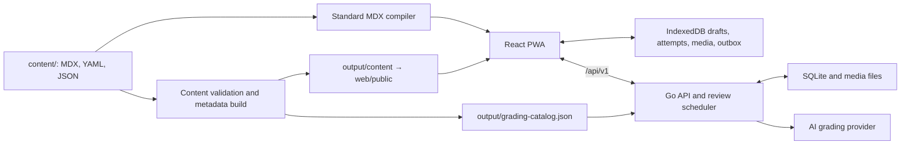

# Architecture

Foundations consists of declarative curriculum, a React/TypeScript PWA, shared
TypeScript contracts and graders, and a Go API with SQLite and filesystem media.

## Curriculum and builds

`content/curriculum.yaml` defines subjects, lesson order, and exercise namespaces.
Lesson documents in `content/lessons/` compile directly to React through
`web/lesson-mdx-options.ts`; `web/src/LessonDocument.tsx` supplies registered lesson
components and `web/src/lessonModules.ts` loads lesson chunks. The service worker
precaches the lesson chunks and bundled curriculum for offline reading.

`tools/content/build.ts` separately extracts metadata and validates structured
curriculum, sources, prerequisites, evidence, and grading contracts. It writes
ignored client assets and the server grading catalog. Metadata extraction is not
the browser's lesson renderer. See [content authoring](content-authoring.md).

## Client, server, and stored work

`web/src/App.tsx` and `routing.ts` coordinate reading and practice routes.
`Exercise.tsx` owns the answer workflow; `storage.ts` persists drafts, attempts,
media, records, and an outbox in IndexedDB. Drafts remain local to the browser.
`sync.ts` uploads submitted work and record mutations, validates acknowledgements,
and integrates the server change feed. Failed synchronization must preserve the
saved answer and queued operation. See [web-client behavior](web-client.md).

The Go server owns authenticated sessions, durable submissions and grade history,
media, review scheduling, and frozen review instances. Mutable records use
revisions and conflict tracking. Server data lives under
`/var/lib/math-foundations`; recovery requires both database and referenced media.
See [deployment](pwa-deployment.md) and [backup recovery](backup-media-integrity.md).

`shared/assessment.ts` and `shared/deterministic.ts` define browser-side structured
grading. Go independently implements the same contracts and verifies submissions;
shared fixtures check conformance. Open answers use server-managed provider jobs.
The [grading guide](grading.md) describes retry and cancellation behavior.

Review scheduling is server-owned. Catalog construction, evidence replay, session
planning, and frozen questions are distinct from the client's Review interface.
[Review](review-system.md) documents those rules; [learning evidence](learning-evidence.md)
explains which observations support progress reporting.

## Compatibility boundaries

Preserve lesson slugs, exercise namespaces and IDs, saved answer formats, and
immutable submission/grade history. A displayed lesson number or a new owner for
an existing exercise does not create a new identity. Native ink remains an import
and rendering compatibility format even though Android is retired.

Grading content versions identify assessment context independently of a web build.
Archived catalogs support saved submissions; issued Review instances retain their
question and grading snapshots. Validate historical restores and frozen questions
when changing those contracts. Compatibility fixtures and independent verification
live with the [tools and tests](tooling.md), not in documentation reports.
