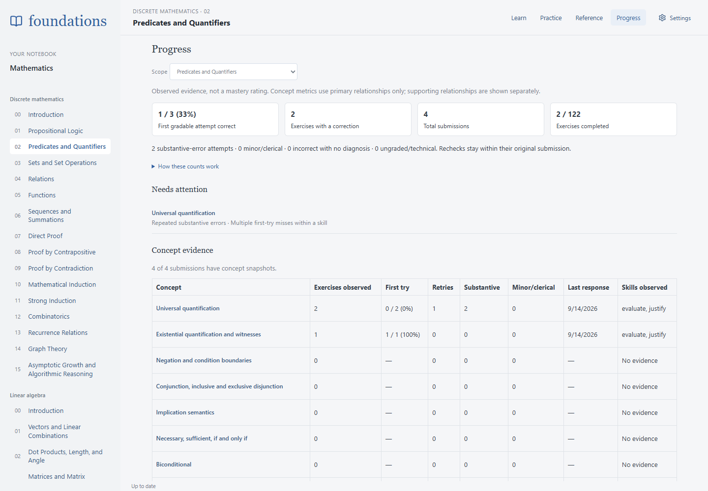
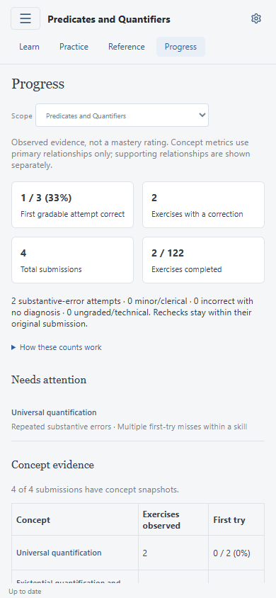
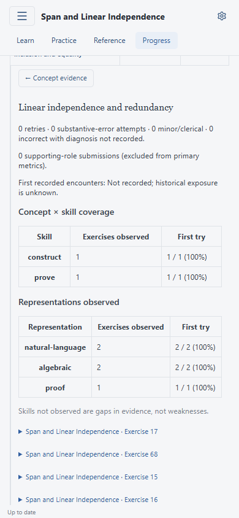
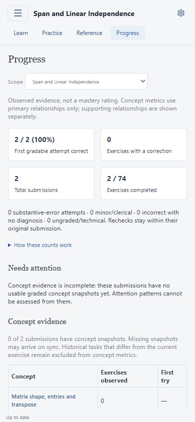

# Curriculum evidence coverage

All 25 exercise-bearing lessons have explicit concept, skill and representation mappings. The two reading-only introductions have no exercises. Canonical exercise IDs, rather than display positions, identify every row.

Authoring reviewed the published instructions and task for each exercise, including promoted checks and current choice formats. Parameter variants share mappings only when they ask for the same mathematical work. Recognition, construction, computation, proof, comparison and counterexamples are distinguished; a choice does not imply that the student supplied a proof. Supporting concepts do not enter primary-concept metrics.

| Lesson                                        | Exercises mapped | Choice exercises | Primary concepts |
| --------------------------------------------- | ---------------: | ---------------: | ---------------: |
| Propositional Logic                           |        155 / 155 |               45 |               18 |
| Predicates and Quantifiers                    |        122 / 122 |               33 |               16 |
| Sets and Set Operations                       |          82 / 82 |                9 |               10 |
| Relations                                     |          82 / 82 |               13 |               10 |
| Functions                                     |          82 / 82 |               12 |                9 |
| Sequences and Summations                      |          82 / 82 |                3 |               13 |
| Direct Proof                                  |          82 / 82 |                4 |               14 |
| Proof by Contrapositive                       |          82 / 82 |                6 |                5 |
| Proof by Contradiction                        |          82 / 82 |                2 |               12 |
| Mathematical Induction                        |          82 / 82 |                4 |               11 |
| Strong Induction                              |          82 / 82 |                3 |               11 |
| Combinatorics                                 |          82 / 82 |                3 |               11 |
| Recurrence Relations                          |          82 / 82 |                2 |               11 |
| Graph Theory                                  |          82 / 82 |               13 |               11 |
| Asymptotic Growth and Algorithmic Reasoning   |          82 / 82 |                4 |               11 |
| Vectors and Linear Combinations               |          76 / 76 |                2 |                4 |
| Dot Products, Length, and Angle               |          76 / 76 |                2 |                6 |
| Matrices and Matrix Multiplication            |          70 / 70 |                2 |                5 |
| Systems of Linear Equations                   |          70 / 70 |                2 |                6 |
| Span and Linear Independence                  |          74 / 74 |                2 |                5 |
| Bases, Dimension, Rank, and Inverses          |          73 / 73 |                2 |                5 |
| Linear Transformations                        |          70 / 70 |                3 |                6 |
| Orthogonality, Projections, and Least Squares |          70 / 70 |                2 |                5 |
| Eigenvalues and Eigenvectors                  |          64 / 64 |                3 |                5 |
| Singular Value Decomposition                  |          74 / 74 |                3 |                8 |

Total: **2060 exercises**, **187 concepts**, **15 skills**, **11 representations**.

## Maintenance

The shared catalogs and Lesson 1 annotations are in `content/learning-evidence.yaml`; each other lesson has explicit rows in `content/evidence/<slug>.yaml`. The content builder merges them and rejects missing exercises anywhere in the curriculum, duplicate rows, unknown IDs, invalid roles and broken teaching anchors. Future lessons require authored mappings before they can build. Validation establishes structural coverage; it does not replace reading and checking task semantics.

Shared concepts are reused across subjects: for example, injectivity supports kernel proofs, uniqueness supports inverse arguments, and induction supports graph and recurrence proofs. Concepts are not generated from section headings. Teaching sections are exposure anchors only. The hierarchy remains shallow; independent concepts need no artificial parent.

Historical metadata is added only by the existing unchanged-task/response-format check. Student work and all grades remain unchanged; unmatched old tasks remain visibly excluded rather than being assigned guessed concepts. No old confidence, effort, assistance or diagnosis is invented.

The Progress page distinguishes no graded evidence from missing metadata, and identifies partial coverage before presenting attention patterns. All current exercise mappings are bundled offline and included in server submission snapshots and exports.

## Browser verification

Synthetic attempts verify Lesson 2 coverage, linear-algebra construction versus proof skills, phone overflow, and missing-metadata messaging. Concepts with observed graded evidence appear first; this is a display grouping, not a ranking of ability.

