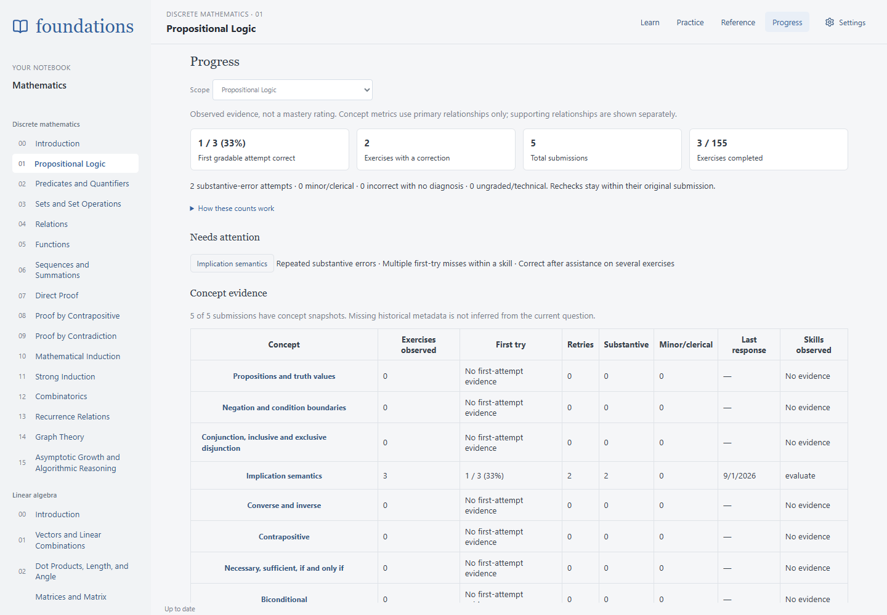
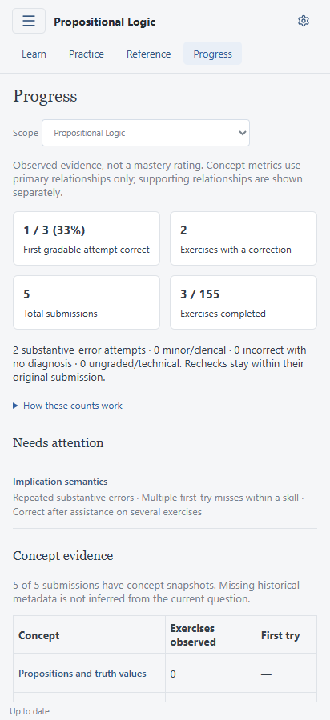
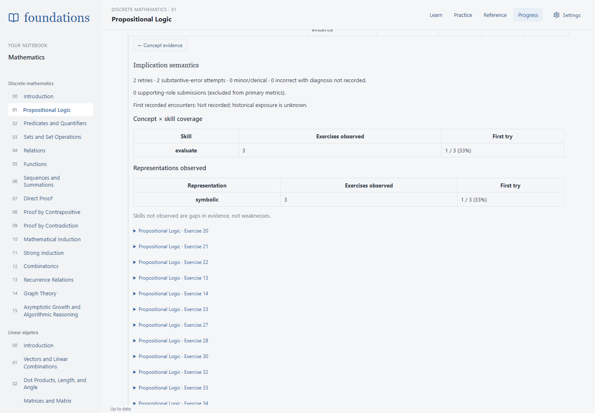
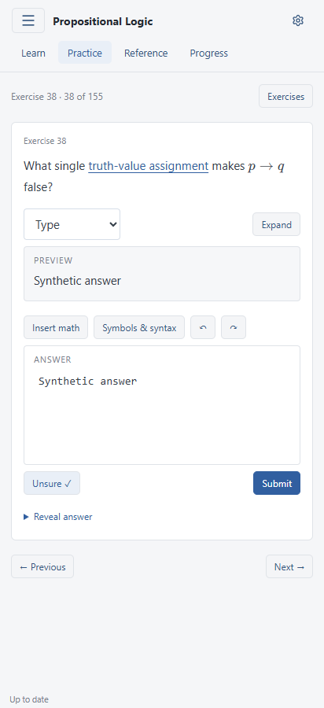

# Learning evidence and grading v5

This change records evidence, not mastery. It adds no scheduling, scoring model, flashcards, unlocking, adaptive generation, or live AI summaries.

## Content and taxonomy

`content/learning-evidence.yaml` and the lesson files in `content/evidence/` are the authored sources. See [complete curriculum coverage](curriculum-evidence-coverage.md). It is independent of section structure and uses the existing YAML/build pipeline. The catalog contains 187 concepts, 15 extensible skills and 11 representations. All 2,060 exercises across 25 exercise-bearing lessons, including promoted checks, have explicit ID-based annotations. The taxonomy separates implication semantics, conditional forms, contrapositive, necessary/sufficient conditions, equivalence, distribution, negation, argument validity, inference, counterexamples, and satisfiability without creating a concept for each wording variant. Sections appear only in optional teaching/exposure anchors, not as analytical categories.

The annotations were written against the actual adapted questions and answers, including current multiple-choice formats, rather than inferred from section names. For example: canonical 77 compares a contrapositive; 74 constructs one; 152 proves with one. Canonical 110 principally measures equivalence and distribution, with implication as supporting knowledge. Tasks can have multiple primary concepts and skills; there are no numerical weights. Supporting concepts are visible but excluded from primary concept metrics. The lesson overview counts each exercise once regardless of how many concepts it measures.

`tools/content/evidence.ts` validates IDs, parent links/cycles, primary/supporting roles, duplicate references, representations, attributes, teaching targets and complete coverage of every published exercise. It derives response format for every annotation and counts explicit logical operators in the displayed math for logic questions. This is a literal operator count, not a difficulty estimate or full syntax-tree depth. No speculative correlation analysis is implemented. Attributes remain a generic scalar map. All lessons have authored task-level annotations. Missing mappings in any lesson fail the content build.

The generated `learning-evidence.json` ships offline. Its content hash is included in the grading catalog version. New contexts snapshot direct concept/skill/representation definitions, roles, attributes, version and provenance; the server supplies this snapshot from its catalog, never trusts a client-supplied analytical snapshot. Names remain interpretable if future catalog entries change.

## Attempts, assistance and exposure

No answer or grade is retroactively fabricated. New submissions preserve optional `startedAt`, `activeDurationMs`, `unsure` and assistance flags in the existing immutable submission JSON. `EffortClock` estimates time between answer interactions, counting at most 30 seconds of silence between events and pausing on window blur/visibility loss. Only accumulated duration and first interaction time are retained. No keystrokes, pointer paths beyond existing pen work, or general event stream are collected. The estimate undercounts silent thought and cannot prove attention. Reload retains accumulated time but adds no closed-page interval. Retry starts a new effort interval.

Submission uses one timestamp for the final interaction, clock pause, and immutable submission. Earlier clients could read the clock after recording submission time and exceed the server's elapsed-time bound. Sync recovers only local submissions explicitly rejected for this timing error, with no server attempt record: it caps an overflowing duration at elapsed time, or omits an untouched zero duration with no start, and requeues the same response and ID. The original rejected payload remains saved. Accepted history, response content, submission/start times, assistance, and grading rules are unchanged; unrelated failures are not retried by this recovery.

The optional **Unsure** toggle has two UI states: marked or not reported. An unchecked toggle must **not** be interpreted as confidence. The nullable boolean representation can also preserve an explicit false from a future client. It never blocks submission or affects grading.

Official-answer visibility is sticky in `assistance.answerPreviouslyRevealed`, even after closing the answer. Existing `revealed` behavior remains intact. Revealed incorrect feedback, including earlier assessments, sets `priorIncorrectFeedbackSeen`. Copying a retry records `copiedFromRetry`; it describes copying, not mathematical assistance by itself. Answer/feedback-seen flags sync as bounded `assistance/<exercise>` records; retained versions are combined with boolean OR so concurrent facts are not discarded. Draft-specific copying stays with the attempt. Legacy data lacking these fields is unknown.

Concept exposure reuses the reader's 1.5-second section visibility/bookmark callback, actual exercise interactions, and deliberate incorrect-feedback reveals. It records the first encounter per concept/source/device, rather than every visit. The UI takes the earliest timestamp per concept/source across devices. `sourceId` identifies the section, exercise or attempt. These are operational exposure proxies, not proof that a learner understood the concept. Historical encounters are not reconstructed. Records use the existing offline mutation queue, conflict preservation, auth and export paths.

## Grading v5

`foundations-grading-5` retains GLM and current provider routing. It first extracts requirements from the actual instructions/prompt, then determines the verdict, then diagnoses. References, titles and metadata cannot add requirements. JSON includes requirement descriptions/satisfaction, optional broad error classes and domain tags, categorical decision confidence, and structured not-graded reasons. Missing explicitly requested explanation is prompt-compliance/missing-requested-justification, not automatically conceptual failure. Correct answers have no error diagnoses. Diagnostic concept/skill IDs must exist in the supplied snapshot.

Guidance explicitly accepts alternative derivations and independently reducing both sides to the same expression. False intermediate work cannot be rescued by a correct final answer when reasoning is requested. Ambiguity is handled as written, with not_graded when material correctness cannot be resolved. Rechecks independently re-evaluate the original response; prior grades are history, not evidence. Clarifications are interpreted but not treated as new work. The entire assessment history remains intact.

New provider responses must contain all schema fields and pass semantic validation. Older stored grades still deserialize with missing fields. Deterministic choices receive an explicit selection requirement and high decision confidence; their wrong selections are **not** automatically labeled conceptual errors. Their diagnosis stays unknown unless authored diagnostics are added later. Infrastructure errors remain retryable, and missing saved images produce a structured missing-image/not_graded result.

Synthetic regression cases cover alternative/two-sided derivations, false intermediate steps, requested versus unrequested explanations, negation boundaries, counterassignments, unreadability, flawed references, recheck reversals and ambiguity. Ordinary tests validate storage, schema, policies, corpus integrity and aggregation; they do **not** prove a model will always follow the prompt. The existing opt-in live harness has eleven targeted v5 cases, disabled unless `FOUNDATIONS_LIVE_TEST_KEY` is explicitly set. No model calls were made for this PR.

## Exact analytical definitions

- **Effective assessment:** the latest assessment of an immutable submission. With old data lacking assessment history, use its stored verdict. A recheck is not a new submission.
- **Gradable attempt:** effective verdict correct or incorrect. not_graded and initial technical failures do not enter mathematical-success/error denominators.
- **Exercises observed:** distinct exercise keys with at least one gradable attempt.
- **First gradable attempt correct:** among observed exercises, the earliest submitted gradable attempt is correct under its latest assessment. Ties use attempt ID. Thus a reversed initial rejection changes first-try evidence without erasing grade history. This measures the response, not original grader agreement.
- **Exercises completed:** distinct exercise keys with a currently correct attempt. This can differ from a never-rechecked historical correct verdict.
- **Exercises with a correction:** distinct exercise keys with any effectively incorrect attempt, whether eventually completed or still needing correction.
- **Retries:** sum of additional gradable submissions beyond the first per exercise. Technical/ungraded attempts and rechecks are excluded. Total submissions includes them.
- **Substantive-error attempts:** unique incorrect attempts whose latest diagnosis includes substantive severity, excluding prompt-compliance, technical and clerical classes from this conceptual/procedural trouble signal.
- **Minor/clerical:** unique incorrect attempts with a minor diagnosis or clerical class. An attempt can have separate substantive and minor issues, so these buckets need not sum to total errors.
- **Unknown diagnosis:** incorrect attempts lacking structured diagnosis; absence is not interpreted as absence of an error.
- **Concept evidence:** the above metrics over primary relationships only. Explicit diagnostic concept IDs restrict attribution; unattributed diagnoses remain exercise-level evidence shared among primary concepts. Supporting relationships are separate. Parent concepts are not automatically rolled up.
- **Skill coverage:** distinct observed exercises for each primary concept × primary skill combination. Representation counts use the same observed-exercise rule. Multi-representation tasks appear in each applicable bucket; buckets are not additive. Absent evidence is not called weakness.
- **Missing first-attempt metadata:** concept/skill/representation first-try rates include an exercise only when its actual earliest gradable submission belongs to that mapped bucket. A later mapped retry cannot become a first-try success merely because earlier metadata is missing. Thus first-try denominators may be smaller than exercises observed.
- **Last response:** latest submission timestamp, not a background synchronization timestamp.
- **Needs attention:** catalog-order listing of concepts with at least two substantive-error attempts, at least two first-gradable misses within one primary skill, or recorded assisted correct responses on at least two exercises. These are transparent flags, not scores or rankings. No inference that assistance proves misunderstanding.
- **Error breakdown:** latest diagnoses from effectively incorrect attempts, grouped separately by broad class and tag, deduplicated by attempt within each bucket. Every aggregate can be traced to submissions and all original assessments.

## Historical integrity and deployment behavior

There is no SQL schema migration: optional JSON fields extend the existing storage. On startup the new backend performs an idempotent metadata-only backfill for historical contexts with unchanged task wording and the same response format. Reference-link formatting and whitespace are ignored in that comparison. Original context text, student responses, grades, IDs, timestamps and content versions are preserved. An emitted attempt revision syncs the added labeled snapshot. Rechecks still use the original task and assessment history.

Changed tasks or converted response formats are conservatively skipped. Their attempts remain in overview counts and the full history but are excluded from concept metrics until an appropriate historical annotation exists. The UI reports snapshot coverage explicitly; it never projects a changed current task onto historical evidence. This is a deliberate limitation; no automatic historical task rewriting, diagnosis generation, or taxonomy migration framework is introduced. Unknown timing, uncertainty and assistance remain unknown. Existing backups remain weekly.

The web build and backend/catalog are released together because the grading catalog version changes. Startup backfills compatible historical submissions and emits revisions for clients to sync.

## Export and verification

Settings export/import now uses browser JSON version 2, preserving attempts, drafts, queued operations, exposure/assistance records and the evidence catalog. It still accepts v1. Imported conflicts remain recoverable rather than overwritten. The exported catalog is explanatory context, never installed as executable/authoritative content. Per-attempt snapshots take precedence. Additional fields are validated and invalid imports are rejected before writes.

`scripts/export-learning-data.py` makes a separate read-only, checksum-manifested analysis ZIP v2 from the server DB, release and media paths. It contains all assessments, original context, metadata, CSV tables, transcriptions and remaining media, including new fields. This durable tool replaces the earlier one-off export procedure. It omits authentication/session data and credentials. It refuses to overwrite an existing archive. This ZIP is for external analysis, not the browser JSON importer. Use browser export separately for device-only drafts.

Run root tests/typecheck, web tests/build, formatting, and Go tests. Python export tests run through the explicit `test:utilities` step in the root suite. After building the web app and installing Chromium, `npm run test:e2e -- evidence` starts its own local Vite server. The script intercepts every API request and creates only synthetic local attempts; it checks routing/reload, phone overflow, concept drill-down, optional uncertainty, effort capture, submission metadata and feedback assistance.

After `npm run web:build`, `npm run test:e2e -- review-submission` checks review submissions against a real Go API with temporary synthetic data. It covers the millisecond boundary, next-item and retry clocks, recovery of an actual rejected submission, typed responses, and restored drafts. Free-response jobs are cancelled and the provider URL stays on loopback. Set `PLAYWRIGHT_MODULE` and `CHROME_BIN` when using an external local browser runtime. The [mobile result](screenshots/review-submission/quick-mobile.png) shows a server-accepted deterministic grade.

Screenshots use synthetic examples only:

Deferred explicitly: spaced repetition/review scheduling, mastery scoring, forgetting curves, psychometrics, adaptive generation, prerequisites unlocking, automatic stronger-model escalation, LLM progress summaries, inferred historical diagnostics, and attribute correlation modeling.

### Review follow-up

Assistance records merge the two sticky facts with logical OR inside the server mutation transaction, including stale writes and explicit resolutions. Request hashes still describe the original request, so retries stay idempotent. Existing record keys remain compatible; already lost facts cannot be reconstructed from discarded versions.

Exposure keys and sync mutations share an IndexedDB transaction-based device-ID initializer, including concurrent first use across tabs. Legacy exposure records remain readable; new records never use a placeholder device identity.

Imported submitted attempts (including queued submissions) must have integral effort timestamps/durations, a positive start no later than submission, and a duration no greater than elapsed time with a start present. Legacy attempts without effort remain valid. Drafts keep their separate validation because they have no submission timestamp.

Authored exercise `skills` accept both a string shorthand for a primary skill and an explicit `{ skill: justify, role: supporting }` object. The same catalog validation checks both forms, requires a primary skill, and rejects unknown IDs, duplicate skills, and invalid roles.

### Cancelling grading

Pending/running assessments have an operation ID. The signed-in client can cancel that exact operation; stale cancellation cannot affect a later retry. Cancellation is persisted, synced across devices, and aborts the active HTTP request. A result arriving after cancellation is discarded. Cancelled first assessments have no mathematical verdict; cancelled rechecks retain previous assessments. Answers remain available for retry grading or a new submission. Cancellation requires a connection and does not promise a refund for provider work already performed.
